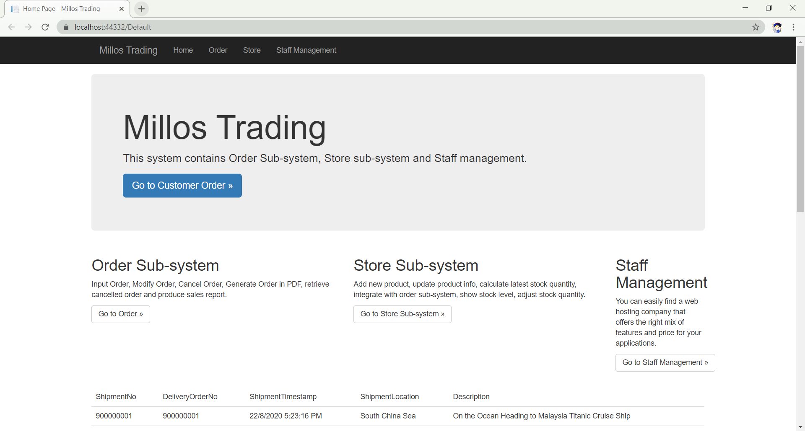

# Millos Trading Web Application

This web application is developed for BACS3003 Software Evolution and Maintenance by RSF3 S1 Group 1 students: 
 1. Tan Kuan Tiong	(18WMR07386)
 2. Liow Ze Ming		(18WMU00414)
 3. Jonathan Jasper Wong Jhing Jyeh	(18WMR01990)

## Setup Instruction
> **Prerequisite:**	
> The web application was developed by ASP.NET framework. Hence, the user will require to install [Visual Studio](https://visualstudio.microsoft.com/downloads/) or any IDE that able to open the .NET project file.

1. First, user will required to open visual studio.
2. Second, user may open the project solution (named: Web.sln) through Visual Studio IDE or clone the web application from [GitHub](https://github.com/TkTioNG/Web.git).
3. Next, execute the project.
4. User right now should be able to use the web application, which look like [this](#screenshot-examples) .

## Details Description

 - The Web application contains three sub-systems: order sub-system, store sub-system and staff management sub-system.
 - The web application integrated with a columnar database using MonetDB.

## Screenshot Examples
Below are some of the web page screenshot examples.
***Main Page***

***Order Page***

***Order Details Page***

***Store Page***

***Product Details Page***

***Staff Management Page***

***Tutorial Box***

## Acknowlegment
Peace >_<, and let me us get 'A'.